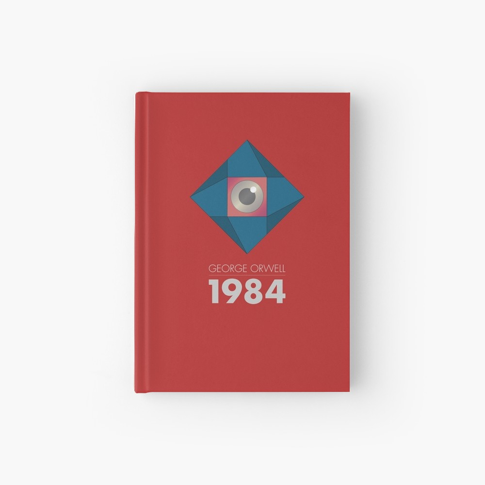
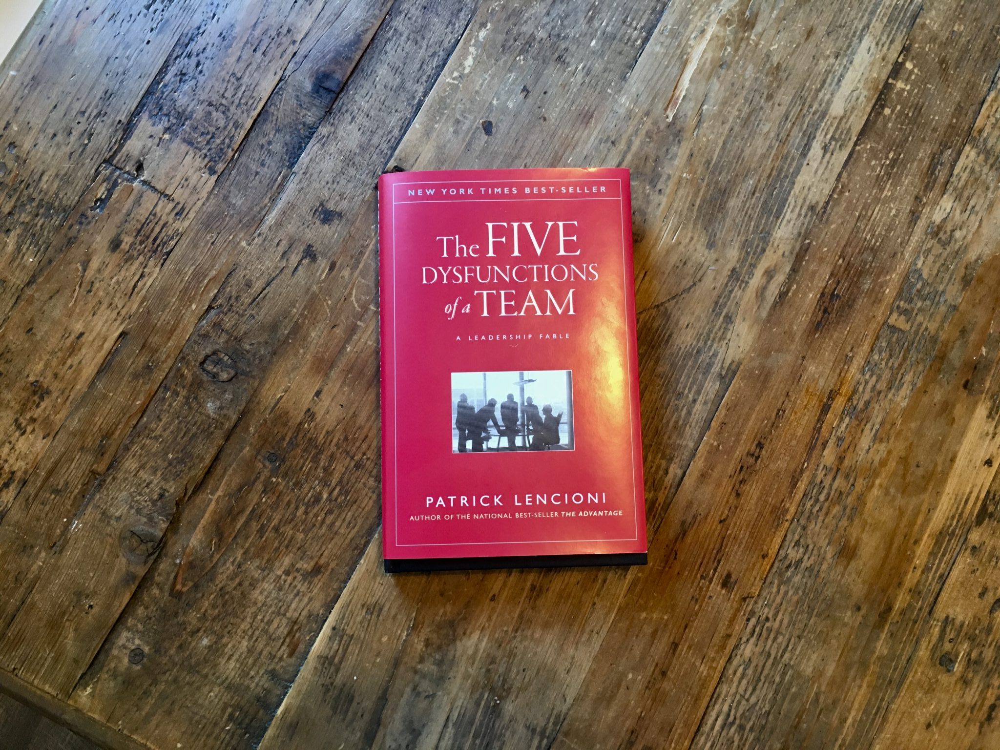
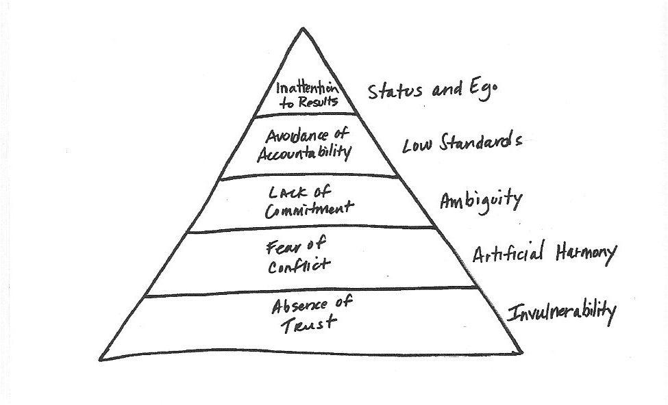
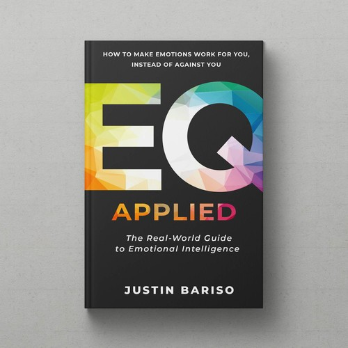
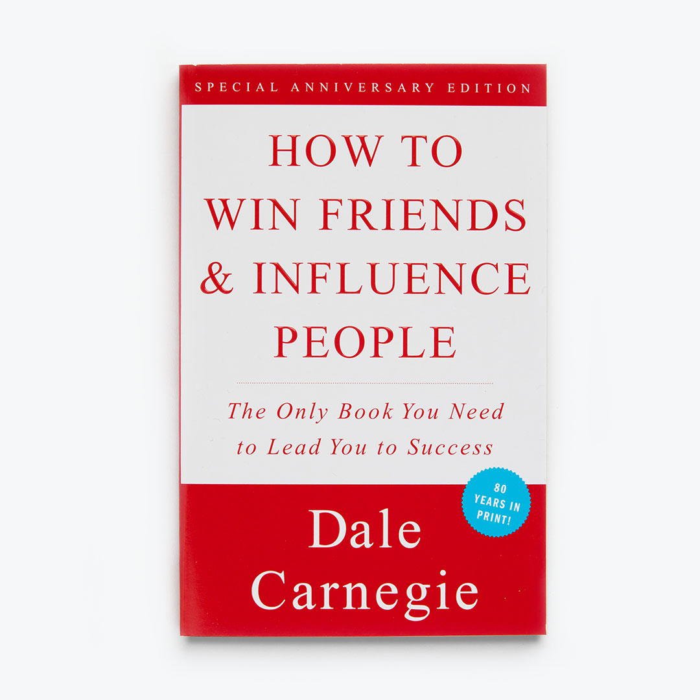

Continuous learning is an adopted philosophy in our company that allows us to expand our knowledge, ideas and our skill-set on an on-going basis. Reading is one of our main tools, and it is also imperative when we are keen to see things in a new light and take that next leap.

This is a reading list of our team most recent favourite picks, we hope you find it useful and enjoyable.

# 1984 - George Orwell (Xico)

In the new digital world, this novel by George Orwell published in 1949 is now more relevant than ever. A satirical portrayal, but realistic, of a world where authoritarian states track and control the thoughts and actions of its people at every turn.

In the world of 1984, freedom of speech is a relic of the past, and even freedom of thought is something punishable with death, or worse. Endless wars plague the globe, political propaganda is a daily occurrence and the government is designed to be a cult of personality, one in which Big Brother is the ever-vigilant leader taking care of its people.

With the ever-increasing data collecting policies of corporations and governments, this book can be a look into a not so distant future of what happens if we don't keep fighting for privacy and freedom of speech.

**Other picks**:

- Thinking in Systems: A Primer - Donella Meadows

# Two-Dimensional Man (Inês)

I'm not even sure how I've stumbled into this book, but I remember it was during my research for [this blog post](https://auroradigital.co/blog/articles/how-to-stay-creative-while-working-on-product-design) about creativity. Paul Sahre is a well-known graphic designer, yet this book is much more than design. "Life can't be designed", he says.

It's a collection of personal essays and how their stories intertwine with his work. He portrays the creative life as one of “constant questioning, inventing, failing, dreaming, and – ultimately – making.”

I recommend this book to everyone searching for inspiration.

**Other picks:**

- [Design: The Invention of Desire](https://www.amazon.com/Design-Invention-Desire-Jessica-Helfand/dp/0300205090)
- [How do you use the internet mindfully?](https://thecreativeindependent.com/library/how-do-you-use-the-internet-mindfully/)

# The Five Dysfunctions of a Team (Filipe)

In this book, Patrick Lencioni creates a fable about a technology company struggling to grow, despite having a highly recognised team and capital.

Kathryn Petersen, the new CEO is confronted with a dysfunctional executive team and pressure from the board to quickly revert the current situation.

With this starting point, the CEO works through each stage of the five dysfunctions model to build an effective team, outlining the key factors that make even the best teams struggle.

The model in pyramidal form:

1. **Absence of trust**: Team members are unable to show their weaknesses and vulnerabilities, wasting energy on defensive behaviours and avoiding calls for help.
2. **Fear of conflict**: With and absence of trust and fearing political consequences, team members are incapable of having unfiltered, passionate debates over the issues and decisions that matter most, replacing it with an artificial harmony.
3. **Lack of commitment**: The lack of vigorous debate does not prevent decisions from being made, but without conflict it’s difficult for team members to commit and buy-in to decisions.
4. **Avoidance of accountability**: It’s as simple as that - “people aren’t going to hold each other accountable if they haven’t clearly bought into the plan”. When commitment is low, it’s easier to turn to excuses if results are not achieved.
5. **Inattention to results**: To create a really functional team, every team member must place team results first. When there is low accountability, individuals invest their time in politics of self-protection and gravitate toward their own personal goals at the expense of collective ones.

**Other picks**:

- High Output Management - Andrew S. Grove
- Shoe Dog - Phil Knight

# EQ Applied: The Real-World Guide to Emotional Intelligence (Catarina)

Justin Bariso presents the idea that “_Emotional Intelligence is the ability to make emotions work for you, instead of against you_”, using research and personal stories that help you reflect on emotions and how they affect your and others’ behaviour. The author also gives action examples to take in different situations.

EQ Applied is a first good book to read if you want to start understanding more about Emotional Intelligence. It allowed me to be more aware of my reactions in daily situations, personal and professional. It also triggered an interest in further deepening this subject, to understand the impact it has on relationships and how we can improve them and ourselves.

# How to win friends & influence people (João)

How to win friends & influence people, was released in 1936 by the American writer and lecturer Dale Carnegie. Despite its almost 80 years of age, it is still a classic and a must for those who want to improve their social, marketing, sales and leadership skills. This is the living proof that human relations are timeless and that who knows how to deal with people will always have a significant competitive advantage. Just a little tip for you who perhaps will read this book, at the end of the day, everything is about understanding the essence of human behaviour itself.
