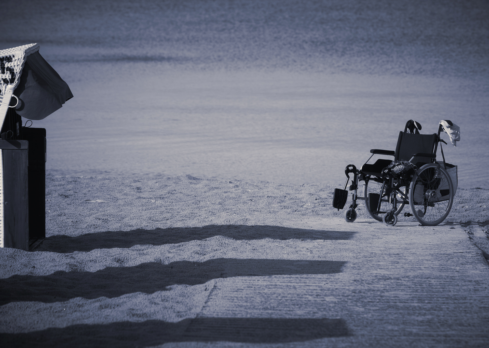

** “#@!C?+!!” ** - That's basically the feeling when you have a sprain. Hurts like hell! It can happen when you least expect it, being the most common joint injury. In my case, the factors were a soccer ball and a sloping plane. However, the problem is not only the momentary pain, which tends to disappear relatively quickly, the worst are the following days.

The days of recovery obviously depend on the extent of the injury, for me, it was a week working remotely. First 3 days hobbling, ice and anti-inflammatory. Last 2 limping. Despite being at home there are always things you have to do: get out of bed, cook, brush your teeth, take a shower, get dressed, get some ice, etc. It is in accomplishing these minimal tasks, that you realize how difficult some become when faced with some difficulty. However, I always felt a need for independence (even if it was a temporary situation), which made me reflect on how present the need for greater autonomy, should be for people with a disability.

According to data from [WorldBank](https://www.worldbank.org/en/topic/disability#1) (Apr 4, 2019), about 15% of the world population suffers from some kind of disability. Persons with disabilities can suffer socioeconomic outcomes, such as less education, poorer health, lower levels of employment, and higher poverty rates. Barriers to full social and economic inclusion include inaccessible physical environments and transportation, the unavailability of assistive devices and technologies, non-adapted means of communication, gaps in service delivery, and discriminatory prejudice.

With that in mind, one can say that accessibility is much more than just not being able to climb a step, zooming on a browser or utilizing a screen reader. It must be regarded as all obstacles, regardless of disability and their respective degree, which reduces or make impossible the accomplishment of a task by any person.

## Technology should remove barriers, not create more

In a world increasingly marked by technological innovation, the internet, smartphones and social media play a major role in the integration of people with disabilities. These allow new means of communication, the empowerment of them in the labor market, and their inclusion in society. There are no limits to what people can achieve when technology reflects the diversity of everyone who uses it. Everyone deserves equal opportunity to blossom and the right to access to technologies and skills that will enable them to achieve more.

As stated by Tim Berners-Lee, W3C Director and inventor of the World Wide Web:

> "The power of the Web is in its universality. Access by everyone regardless of disability is an essential aspect."

The web removes barriers to communication and interaction that many people face in the physical world. Many people use assistive technologies to work around these issues, such as alternative keyboards, screen readers, speech recognition software and braille terminals. However, when websites, applications, technologies, or tools are badly designed, they can create barriers that exclude people from using the Web. Fortunately, there are some steps to avoid those mistakes and make the web welcoming to _all_ visitors, so I'll name a few:

- _Keyboard-Friendly._ All major features must be available via a keyboard and nothing else (accessing all pages, links, content, etc).

- Add _alt_ text to all images. This one is really mandatory as it works as a replacement for the image if it fails to load. It is also used by screen readers to "read" the picture, giving context to users who would otherwise miss it.

- Choose _colors_ carefully with a suited contrast, ensuring everyone can distinguish between various elements on the page.

- Use Headers to structure your content correctly. Content is much easier to understand, improves flow and helps screen readers interpret the pages.

- Use [ARIA landmarks](https://accessibility.oit.ncsu.edu/it-accessibility-at-nc-state/developers/accessibility-handbook/aria-landmarks/). Tags that can be added to elements on a page to define content more effectively. It is also used for making navigation more straightforward as e.g. it lets users skip directly to specific content.

There is a lot that can be done to improve accessibility, and it's relatively easy to do so. We just need to start thinking of it from the first steps of design, instead of fixing a product that is already inaccessible.

Accessibility won't force a product to be less appealing. It simply presents challenges that push the limits of our creativity, in order to create [solutions available to everyone, everywhere, at anytime](https://auroradigital.co/).
