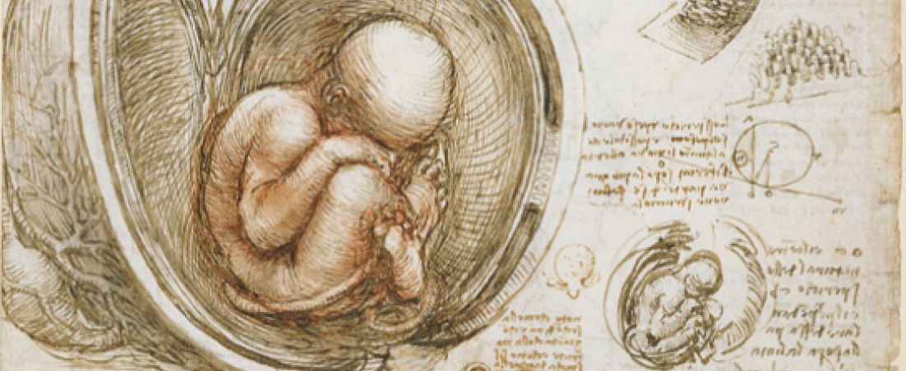

<div className="Blog-banner">



</div>

Some of us love to look back in history and travel in their own thoughts through the different ages, others love to lose themselves in predicting the future yet to come.

For quite some time, I have been deepening my study about Gutenberg's achievements in life and the downfall of a man who changed remarkably his society. We can imagine a world without cars, computers and telephones, but it's very difficult to imagine a society anything like we have today that doesn't have the printed word.

For those who don't know him, Johannes Gutenberg was the inventor of the movable type printing press that democratized information and would change the face of Europe and the world forever. He lived during the middle ages, somewhere between 1400 and 1468 in Mainz (Germany), was an intellectual of his time, a goldsmith and blacksmith from a profession, a merchant and an entrepreneur from passion.

While Gutenberg secretly worked on his invention, he spotted two different market segments. First, Universities were springing at the time and these different skills, helped him to figure out a way in giving the right answer to the strong demand for books. From the other hand, the Church segment itself looked at the printing press with distrust, fearing anything that might break their monopoly upon knowledge. But soon, Church leaders took advantage and found a way to use the printing press in their favour with the intention to unify and spread their influence through Europe, by quickly speeding up the sales of Indulgences and by ordering 180 copies of the Holy Book, known famously by the Gutenberg's Bible.

## A vision of today into the future

When we look at the past in an attempt to understand the future, we often realize that history is made up of moments and stages that seem to repeat themselves in certain cycles. The contemporary Age, the period in which we have lived since the French Revolutions of 1789, seems to have come to an end and we are facing the emergence of a new Age which, for now, we can call it the "Age of Digitalization". It is crucial to realize this.

Almost 20 years after the use of the Internet as a consumer good, we witnessed a massive change in global social norms, only assisted in the moments after Gutenberg’s invention. Knowing and relating to other human beings on the internet, or even "hitchhiking" from strangers at any time of the day could be strange but, not anymore. It is absolutely stunning if we stop to think that none of the applications that are part of our daily lives existed 15 years ago. Today, these same applications can capture most of our day-to-day attention, as we are sucked in by a mysterious force. How fast everything was…


In the last decade, we have witnessed the revolution and the dissemination of smartphones, which have become an extension of the human being, through which we can access an unimaginably powerful source of personalized and real-time information. Is it fair, in this analogy, to equate smartphones as being the new "books of the past", in which we sought in the transmitted knowledge, the answers to the sense of the "self" and liberation in space and time?

In the years after Gutenberg's invention, there were other technological innovations and personalities we remember for posterity. Will the organizations like Google and enterprising personalities like Jeff Bezos (Amazon), Steve Jobs (Apple), Mark Zuckerberg (Facebook) or Elon Musk (Tesla and SpaceX) be remembered in the future, as part of a past that gave birth to an era as majestic as it was of the Renaissance? In the end, Gutenberg himself was also behind the opportunities of his time, and today, great opportunities are formed in other equally impacting areas such as, Big data, artificial intelligence, augmented reality, blockchain and robots, which will make the future even more colossally disruptive.

It’s a Vim function that you can trigger with `C-]` or call with `:call AngularTemplateToDirective()` (or map to a shortcut). Notice that it uses a module called VIM on line three. That module comes from Vim and it allows us to control it from the Ruby. If you want to learn more use :help ruby inside Vim.

```
mkdir cenas
cd cenas
yarn dev
```
