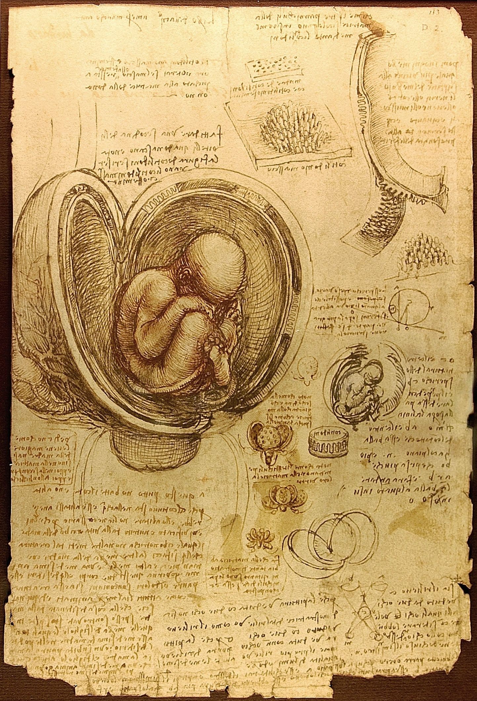

Some of us love to look back in history and travel in their own thoughts through the different ages, others love to lose themselves in predicting the future yet to come.

For quite some time, I have been deepening my study about Gutenberg's achievements in life and the downfall of a man who changed remarkably his society. We can imagine a world without cars, computers and telephones, but it's very difficult to imagine a society anything like we have today that doesn't have the printed word.

But, what on earth this has to do with the new digital healthcare era? Well, first of all, allow us to introduce some historical content.

## The great Gutenberg's invention.

It is important to mention knowledge was locked in the precious objects called books that were only available to nobility and the clergy and thus physically kept in the cathedrals, monasteries and churches. A reproduction of the Bible could take three entire years to be made by the hand of a single scribe. This new technological invention could not be stopped and - the movable printing press - was quickly replicated in many several medieval cities which brought with it the mass production and standardization, reducing abruptly over the years their cost and time, making books available to less affluent and common people, never seen before in history.

From now on, on the same page number, the first and the last letter could be read the exact same way in a palace in Florence, a private house in Bruges or Lisbon. Isn't that impressive?

## Breaking with the past - the Renaissance

Within 50 years after the invention of Gutenberg's movable type printing press, the production of books skyrocketed passing almost from zero to twenty million in total. New ideas and knowledge were diffused and spread throughout Europe like a benign virus which was responsible years later to kickstart one of the most creative and exciting periods we had on our history - the Renaissance.

Every one of us heard names such as Michelangelo and Leonardo da Vinci that raised painting, science, art and medicine to the next level or philosophers like Niccolò Machiavelli and Thomas More on the Humanism field. Also, new worlds were found by European navigators such as Christopher Columbus when he landed in America or Ferdinand Magellan, who circumnavigated the Earth. In religion, the translation of the Latin Bible into several vulgar unprestigious languages like German, Italian and French, had a huge impact on the "establishment", bringing complete new different interpretations of the Bible and the relationship with God. Years later, these events culminated in the Protestant Reformation such as the revolutionary ideas from John Calvin and Martin Luther, which used the printing press to spread 300.000 copies throughout Germany (and quickly as far as Italy and England) of the Ninety-five Theses against the Catholic Indulgences.

The Renaissance was a break from the past and a bridge between the medieval world and modernity. It broke old paradigms into a new era, enhanced the expansion of critical thinking and creative expression of the "self" and above all, the individual's pursuit of the liberation. It literally changed the way we communicate, how we exercise power and allow us to travel to unimaginable distances.

## A new Gutenberg's moment for the world's society.

When we look at the past in an attempt to understand the future, we often realize that history is made up of moments and stages that seem to repeat themselves in certain cycles. The contemporary Age, the period in which we have lived since the French Revolution of 1789, seems to have come to an end and we are facing the emergence of a new Age which, for now, we can call it the "Age of Digitalization". It is crucial to realize this.

> “Almost 20 years after the use of the Internet as a consumer good, we witnessed a massive change in global social norms, only assisted in the moments after Gutenberg’s invention.”

Almost 20 years after the use of the Internet as a consumer good, we witnessed a massive change in global social norms, only assisted in the moments after Gutenberg’s invention. Knowing and relating to other human beings on the internet, or even "hitchhiking" from strangers at any time of the day could be strange but, not anymore. It is absolutely stunning if we stop to think that none of the applications that are part of our daily lives existed 15 years ago. Today, these same applications can capture most of our day-to-day attention, as we are sucked in by a mysterious force. How fast everything was…

In the last decade, we have witnessed the revolution and the dissemination of smartphones, which have become an extension of the human being, through which we can access an unimaginably powerful source of personalized and real-time information. Is it fair, in this analogy, to equate smartphones as being the new "books of the past", in which we sought in the transmitted knowledge, the answers to the sense of the "self" and liberation in space and time?

In the years after Gutenberg's invention, there were other technological innovations and personalities we remember for posterity. Will the organizations like Google and enterprising personalities like Jeff Bezos (Amazon), Steve Jobs (Apple), Mark Zuckerberg (Facebook) or Elon Musk (Tesla and SpaceX) be remembered in the future, as part of a past that gave birth to an era as majestic as it was of the Renaissance? In the end, Gutenberg himself was also behind the opportunities of his time, and today, great opportunities are formed in other equally impacting areas such as, Big data, artificial intelligence, augmented reality, blockchain and robots, which will make the future even more colossally disruptive.

## Digital Healthcare Society - the future.

As well as other areas of society, the healthcare industry will also undergo immense transformations in the not-as-distant future. If we look closely at how healthcare is organized, we quickly conclude that they are still professionally dominated by a theocratic model with a high pyramidal hierarchy, differing from processes between hospital entities, regions and even countries. Although we are moving towards the democratization of information, doctors and hospital units are still the great custodians and holders of the clinical knowledge produced by all of us, even though they are shared with laboratories, research centres and institutions such as the pharmaceutical industry. Could we once again turn to history and find some similarity?

> “If we look closely at how healthcare is organized, we quickly conclude that they are still professionally dominated by a theocratic model with a high pyramidal hierarchy, differing from processes between hospital entities, regions and even countries.”

The [smartphone revolution brings with it a set of mobile health applications](https://www.iqvia.com/newsroom/2017/11/impact-of-digital-health-grows-as-innovation-evidence-and-adoption-of-mobile-health-apps-accelerate) that, integrated with a new wave of innovation applied to sensors (wearables, digital, biological and nano), and with techniques of machine learning (AI), enable us - to recognize patterns that have hitherto been unknown, and which will affect the way we treat and face diseases. With this, we will be able to constantly monitor and diagnose our health, and get real-time results. If we add here the advances that we have made in the area of ​​[genetic sequencing (genomic), which in a few years will become more widespread](https://www.veritasgenetics.com/next-genomics-revolution-era-social-genome), we will be able to predict the genetic predisposition of diseases, manage and decide on the most effective medication, lifestyles and diets appropriate to each one of us. Gradually we will change the paradigm, striding towards a truly personalized preventive rather than curative medicine.

For the first time in history, health data will be also held by people themselves who may or may not share with entities within the health system itself. We are more and more educated and demanding, but more and more we will want a perfect health system, in the immediate and preferably free. We will use tools like telemedicine simply for convenience and idleness. The relationship between patient and physician will change radically, which will also have an impact on the cost structure and where budgets are allocated in our health systems.

We hope that these and future technological innovations will help us overcome some of the challenges we face in our health systems, such as the lack of doctors, the very financial sustainability of the system itself, directly linked to the ageing of the population. We live longer and better, but the extension of our lives has a cost for all of us as a society.

> “In the next 20 years, we will learn more about ourselves than the sum of what we learned during the centuries prior. It is a tremendous gift to witness all this.”

It is said that the first human to live to 150 years is already alive. Looking back, it is wonderful to see what we have achieved so far in terms of our longevity and quality of life. Much has been done in medicine: we control viruses, we eradicate diseases (and will continue to do so) and now, it seems that we will complete the puzzle by opening the knowledge of our [genetic code locked in each one of us](https://medicalfuturist.com/the-genomic-data-challenges-of-the-future). It is fair to say that humanity despite all the challenges has never lived so long and so well. But, as humans what are we really seeking for? Living just longer and better, is that it? Or instead, we are rather pursuing some kind of immortality?

Being on the tipping point of a new coming Age, [along with our life journey as a company](auroradigital.co), we will hopefully try to answer some of the questions we did above. Primarily, we aim to contribute to the humanizing of technology and make it even more available to humans, just like the ones who worked centuries ago on the printing press machines and in the book's dissemination. Ultimately, we want to complete our mission: design and develop thoughtful web and mobile healthcare solutions, accessible to anyone, everywhere, at anytime.

In the next 20 years, we will learn more about ourselves than the sum of what we learned during the centuries prior. It is a tremendous gift to witness all this.
